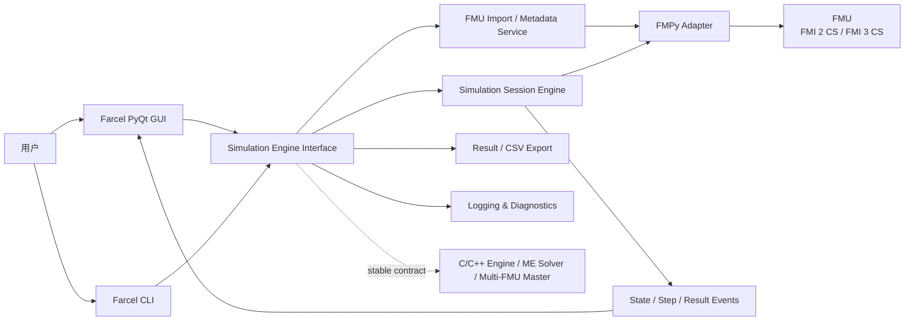
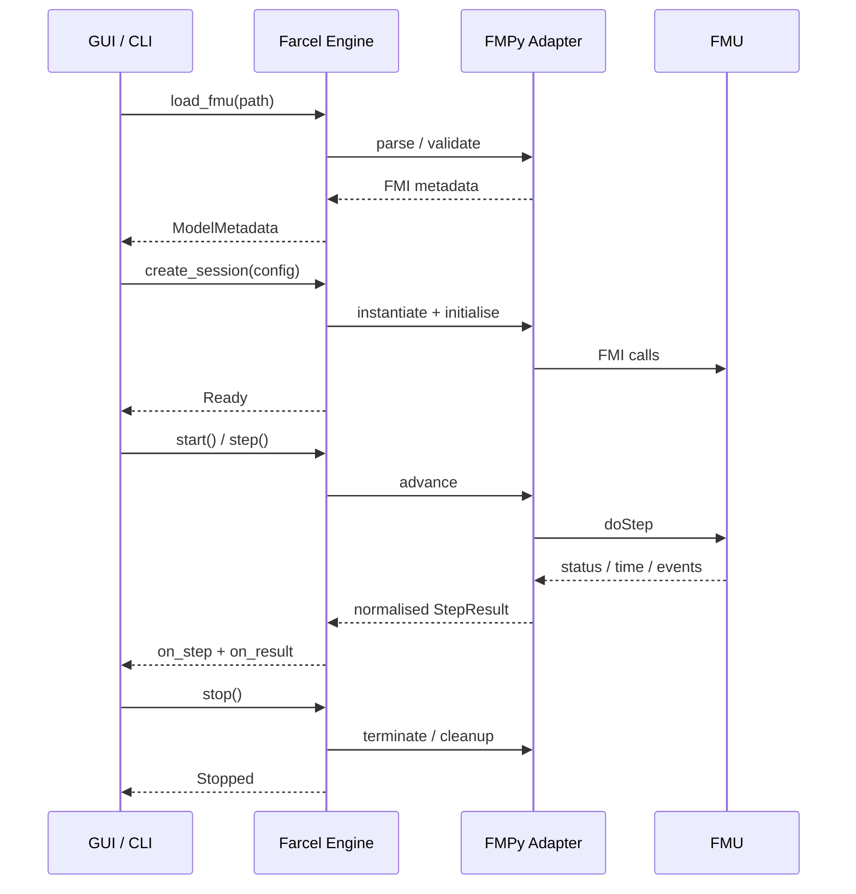

# Farcel 轻量级 FMU 仿真工具项目规划报告

## 执行摘要

Farcel 建议定位为一个**本地优先、轻量、桌面 GUI + CLI 共用同一仿真核心**的 FMU 导入、配置、执行、观察与结果导出工具。两名开发者应以清晰的“UI/应用层—Simulation Engine”边界并行工作：前端开发者负责 Python + PyQt 桌面交互与结果呈现；后端开发者负责 Python + FMPy 仿真引擎、FMU 解析、运行控制、CLI、验证、日志与结果数据。前端**不得直接依赖 FMPy 对象或 FMI C API**，这样可以为未来将仿真核心迁移到 C/C++ 保留稳定边界。

截至 **2026 年 8 月 26 日**，FMI 官方站点列出的维护版本包括 FMI 2.0.5 与 FMI 3.0.2；FMI 3.0 定义 Co-Simulation、Model Exchange、Scheduled Execution 三类接口。FMU 本质上是 ZIP 容器，至少通过 `modelDescription.xml` 描述公开变量、模型结构和能力，并可包含平台二进制、源代码、资源和文档。citeturn11search1turn2view1

为控制两人项目规模，建议 Farcel v1.0 的**可执行仿真范围**明确为：

| FMU 类型 | Farcel v1.0 范围 | 说明 |
|---|---|---|
| FMI 2.0 Co-Simulation | **完整支持** | 导入、配置、初始化、start/stop/step、结果、CSV |
| FMI 3.0 Co-Simulation | **完整支持** | 包括能力检测，并逐步覆盖 Event Mode / Early Return |
| FMI 3.0 Model Exchange | **可导入、解析、展示元数据；暂不执行** | 后续通过 Solver Adapter 扩展 |
| FMI 3.0 Scheduled Execution | **可导入、识别；暂不执行** | 后续 Scheduler 扩展 |
| FMI 1.x | 不纳入 v1.0 | 避免扩大兼容矩阵 |

这一边界符合 FMI 的架构：Co-Simulation 通常由 FMU 内部承担积分/调度，而 Model Exchange 要求 importer 提供数值积分；Scheduled Execution 则要求 importer 调度 model partitions，因此后两者显著增加仿真器责任。citeturn2view1

当前 FMPy 主仓库声明支持 FMI 1.0/2.0/3.0、Co-Simulation 和 Model Exchange；截至本报告日期，PyPI 最新版本为 **FMPy 0.3.31，2026 年 8 月 13 日发布，并要求 Python ≥3.10**。建议 Farcel 初始基线固定一个经过项目回归测试的 FMPy 版本，而不要自动漂移依赖版本。citeturn14view0turn5search0

建议总计划为 **10 周**，假设两名开发者近乎全职投入：

- **MVP：第 1–4 周**——完成单 FMU FMI 2.0/3.0 CS 核心工作流。
- **Beta：第 5–7 周**——强化 FMI 3.0、step/stop、事件、错误处理、验证和较大数据集。
- **v1.0：第 8–10 周**——兼容性回归、交付质量、文档和未来扩展边界冻结。

## 技术基线、范围与总体架构

FMI 3.0 的 `modelDescription.xml` 中公开变量具有 `valueReference`、类型、causality、variability 等属性；FMI 3.0 还增加了数组、更多整数类型、Float32、Binary、Clock、结构参数以及更完善的 Co-Simulation Event Mode、Intermediate Update 和 Early Return 机制。citeturn1search1turn2view1 FMPy 的当前 `read_model_description()` 可以直接从 FMU ZIP 内读取 `modelDescription.xml`，按 FMI 版本选择相应 XSD，并产生统一的 `ModelDescription` 对象；它也提取 DefaultExperiment、生成工具、变量等信息。citeturn17view2

因此 Farcel 不应自行实现另一套 FMI XML 语义，而应在初期建立**Farcel 自己的规范化元数据 DTO**，由后端把 FMPy/FMI 数据映射进去。这将防止 PyQt UI 与 FMPy 内部类结构绑定，并为 C/C++ 后端迁移创造条件。



FMI 3.0 的 Co-Simulation 时间推进由 `fmi3DoStep` 完成，调用包含当前 communication point、communication step size，并返回 `eventHandlingNeeded`、`terminateSimulation`、`earlyReturn` 和 `lastSuccessfulTime` 等状态。因此 Farcel 的 engine contract 不应只返回“成功/失败”，而应保留“实际到达时间、事件、提前返回和终止请求”这些概念。citeturn9view3

**两名开发者责任比较**

| 领域 | 前端开发者：Python + PyQt | 后端开发者：Python + FMPy |
|---|---|---|
| FMU 导入 | 文件选择/拖放、最近文件、加载状态 | 文件检查、解析、FMI 类型/平台/能力识别 |
| 模型信息 | 元数据浏览、变量筛选/搜索 | 产生规范化 `ModelMetadata` |
| 参数配置 | 参数编辑器、类型/范围提示 | 语义验证、默认值解析、向 FMU 应用参数 |
| 仿真条件 | start/stop/step/output 设置 UI | `SimulationConfig` 验证和执行 |
| 控制 | Start / Stop / Step 操作与状态显示 | Session 生命周期与 FMI 调用 |
| 结果 | Plot、Table、变量选择 | 采样、结果缓冲/分块、typed result |
| CSV | 选择位置、触发导出、用户反馈 | CSV 数据生成和一致性保证 |
| 日志 | 日志窗、等级筛选、错误提示 | FMI/FMPy/Engine 结构化日志 |
| CLI | 无需实现业务逻辑 | inspect / validate / run / export |
| FMI/FMPy | **不得直接依赖** | 唯一 FMI/FMPy Adapter 所有者 |
| 测试 | UI、状态机、mock engine、集成测试 | Reference FMU、数值回归、CLI、错误路径 |

FMPy 自身已经提供命令行 FMU 信息读取和仿真能力，并提供 `simulate_fmu()`、绘图及高级调用示例；Farcel 应将这些能力视为后端实现参考，而不是直接把 FMPy GUI 或 CLI 暴露给产品用户。citeturn8view4turn14view0

## 前端开发者项目规划报告

**目标与边界。** 前端的唯一业务依赖应是 Farcel Simulation Engine Interface。它负责把用户意图转为规范化请求，并把 engine 的 metadata、state、step/result/log/error events 映射成桌面体验；不负责 FMU 解压、XML 解析、FMI 状态机、solver、value reference 管理或 FMPy 调用。

**必须提供的用户工作流**

| 优先级 | 前端能力 | v1.0 要求 |
|---|---|---|
| P0 | FMU 打开/导入 | `.fmu` 文件选择，显示 loading / valid / unsupported / error |
| P0 | 模型元数据 | FMI 版本、接口类型、模型名、平台、默认实验、变量数量及变量属性 |
| P0 | 参数配置 | parameter/start values 编辑、恢复默认、错误提示 |
| P0 | 仿真条件 | start time、stop time、step size、output interval、tolerance 等可适用字段 |
| P0 | 输出选择 | 搜索并选择需要记录/绘图的 variables |
| P0 | Simulation Control | Start、Stop、Step；按钮状态与 engine state 严格一致 |
| P0 | 可视化 | 时间序列 Plot 与数据 Table |
| P0 | CSV Export | 路径选择、覆盖确认、完成/失败反馈 |
| P0 | 日志与错误 | 日志面板以及用户可理解的错误摘要 |
| P1 | 项目保存/恢复 | 保存 `.farcel.json` 并重新打开 |
| P1 | FMI 3 数组显示 | 元数据层理解 shape；结果可合理展开/选择 |
| P1 | 大模型可用性 | 大量变量时支持搜索、筛选、选择而不要求全部绘制 |
| P2 | 多图布局/视图模板 | 不阻塞 v1.0 |
| P2 | 多 FMU 画布 | 后续 multi-FMU 阶段 |

FMI 3.0 变量可以是多维数组，数组在规范 API/XML 中具有明确维度及序列化顺序，因此 UI 的变量模型必须能够表达 `shape`，不能假设“一条变量 = 一个标量 Real”。citeturn1search1 同理，FMI 3.0 还包含 Float32/64、多种整数、Boolean、String、Enumeration、Binary 和 Clock；建议 v1.0 对这些类型**全部正确展示元数据**，但 Plot 重点支持数值、Boolean 和 Enumeration，Binary/Clock 不强行映射成普通曲线。citeturn2view1turn9view1

**交互状态模型建议**

`NoModel → Loading → Ready → Running → Stopping/Stepping → Completed | Stopped | Error`

GUI 必须依据后端发出的状态事件更新控制，而不是自己猜测仿真是否结束。尤其 FMI 3.0 的 FMU 可以在 `doStep` 后请求 termination、事件处理或 early return，因此“点击一次 Step 就一定前进完整 dt”不能成为 UI 假设。citeturn9view3

**非功能要求。** 仿真期间 PyQt 界面必须持续可响应；长仿真不得要求 GUI 一次性持有完整数据副本；metadata/result/error DTO 必须与具体 FMPy 类型无关；GUI 与 CLI 通过同一配置语义得到等价仿真结果；不同 DPI、窗口缩放和典型 Windows/Linux 环境应完成 smoke test。

**测试策略。** UI 单元测试以 mock Simulation Engine 为主，覆盖加载成功/失败、参数验证反馈、Start→Stop、单步、完成、运行中错误、CSV 成功/失败。集成测试只需要少量真实 Reference FMU，以验证真正 metadata 和 result event 能正确显示；官方 Reference FMUs 专门用于 FMI importer 的开发、测试和调试，其中包含 BouncingBall、Feedthrough、Stair、StateSpace 等模型。citeturn7search0turn7search1

**阶段交付物。** MVP 交付完整“Open → Configure → Run → Plot/Table → Export”流程；Beta 交付 robust Stop/Step、FMI 3 数组与事件表现、项目保存和完整错误 UX；v1.0 交付 UI 回归测试、用户操作说明、跨平台 smoke test 和冻结后的 engine contract 适配层。

**迁移考虑。** 前端不应因 C/C++ port 改动业务页面：未来仅替换 engine transport/adaptor。Multi-FMU 后续可以把“单 FMU 页面”升级成 system workspace，但当前参数、变量选择、运行状态和 result view 应继续复用。

## 后端开发者项目规划报告

**目标与边界。** 后端是 Farcel 的“可信业务核心”：拥有 FMU 解析、FMI/FMPy Adapter、Session 生命周期、参数和仿真条件验证、执行、结果生成、CSV、CLI、日志、错误规范化及测试基准。GUI 和 CLI 均不得绕开这一层。

当前 FMPy `simulate_fmu()` 已暴露 start/stop time、step size、relative tolerance、output interval、start values、inputs、selected outputs、logging、step callback，以及 FMI 3 Co-Simulation 的 `early_return_allowed` 和 `use_event_mode` 等能力；Farcel 应在其上建立更稳定、更小的项目级接口，而不是把这个函数签名直接作为前后端契约。citeturn17view0 FMPy 也提供独立 `instantiate_fmu()` 路径，并能根据 model description 选择 FMI 2/3 Co-Simulation、Model Exchange 等对象，这使逐步执行和未来扩展具备可行基础。citeturn17view1

**核心责任**

| 后端服务 | 范围 |
|---|---|
| FMU Importer | 打开 `.fmu`、验证容器、读取 `modelDescription.xml` |
| Metadata Normaliser | 把 FMI 2/FMI 3 差异转换为 Farcel DTO |
| Capability Detector | FMI version、CS/ME/SE、platform、event/early-return 等能力 |
| Configuration Validator | 参数类型、范围、时间范围、step/output interval 合法性 |
| Simulation Session | load / initialise / start / step / stop / terminate / cleanup |
| Result Recorder | 选定变量、采样时间、结果 chunk |
| Export Service | UTF-8 CSV |
| CLI | inspect / validate / run / export |
| Diagnostics | Engine/FMI/FMPy 日志、错误分类、运行标识 |
| Adapter | 将 FMPy 隔离在单一边界内 |

FMPy 的 `read_model_description()` 当前可以不解压整个 FMU 而直接读取 ZIP 中的 `modelDescription.xml`，并可进行 FMI schema validation。因此 metadata import 应优先完成解析后再决定是否具备当前平台可执行 binary，而不能将“模型能读”与“模型能跑”混成一个状态。citeturn17view2

**FMU 元数据至少提取**

`fmi_version`、`interface_types`、`model_name`、`description`、`guid/instantiation_token`、`model_identifier`、`generation_tool`、`generation_time`、`platforms`、`default_experiment`、capability flags、variable count，以及每个变量的：

`name`、`value_reference`、`data_type`、`causality`、`variability`、`initial`、`start`、`min`、`max`、`unit`、`display_unit`、`description`、`declared_type`、`shape`。

FMI 3.0 规范明确把变量定义置于 `ModelVariables`，以 unique value reference 标识；`causality` 表示相对于 FMU 的信息流方向。citeturn1search1 DefaultExperiment 可提供 start/stop/tolerance 等默认条件，而 FMPy 当前也将这些字段解析进 model description。citeturn9view2turn17view2

**CLI 范围建议**

```text
farcel inspect  model.fmu [--json]
farcel validate model.fmu
farcel run      model.fmu --config run.farcel.json
farcel export   <result-or-run-id> --csv result.csv
```

CLI 必须使用和 GUI 完全相同的 `SimulationConfig`、engine 和 validation，不建立第二套执行代码。

**日志和错误分类。** 至少区分 `IMPORT_ERROR`、`VALIDATION_ERROR`、`UNSUPPORTED_FMI`、`UNSUPPORTED_INTERFACE`、`PLATFORM_BINARY_MISSING`、`CONFIG_ERROR`、`INITIALIZATION_ERROR`、`FMI_RUNTIME_ERROR`、`TIMEOUT/CANCELLED`、`EXPORT_ERROR` 与 `INTERNAL_ERROR`。错误对 UI 提供稳定 code + message + details；底层 FMPy exception 文本只放 diagnostics，不作为 UI contract。

**非功能要求。** 相同 FMU、配置、FMPy 版本及平台应产生可重现结果；任何失败路径必须释放 FMU/session 资源；停止请求应具有有界响应而不能让 GUI 永久等待；大量输出变量时结果传递应支持分块；后端必须能脱离 GUI 运行测试和 CLI。

FMPy 在 2026 年仍持续发布修复，例如 0.3.30/0.3.31 紧邻本报告日期发布，最近版本持续包含 FMI、变量、solver 等调整，因此项目必须锁定依赖并通过 Reference FMU 回归后才能升级。citeturn5search0turn5search1

**阶段交付物。** MVP：Importer、Metadata、FMI2/3 CS Session、CLI、CSV、日志与接口；Beta：FMI3 Event Mode/Early Return、step/stop 稳定性、数组和错误路径、独立验证；v1.0：Reference FMU 回归矩阵、API/CLI 文档、性能与资源清理测试、C/C++/ME/multi-FMU 扩展设计说明。

**迁移考虑。** FMI 规范 API 本身以 C 定义，因此未来 C/C++ engine 可以保留当前 DTO 和 session contract，仅替换内部 adapter。citeturn2view1 Model Exchange 扩展应增加 `SolverAdapter` 而不是修改 GUI contract，因为 FMI ME 明确要求 importer 负责时间推进、continuous states、derivatives 和事件处理。citeturn2view1turn8view1 Multi-FMU 则增加 orchestrator/master 层；FMI 3.0 规范本身已经展示 connected FMUs 通过读取输出、设置输入并分别 `doStep` 的基本模式。citeturn8view2

## 共享数据契约与仿真引擎接口

**推荐文件格式**

| 内容 | 推荐格式 | 原因 |
|---|---|---|
| 模型 | 原始 `.fmu` | 保持 FMI 标准容器不变 |
| Farcel 项目/运行配置 | UTF-8 JSON，建议扩展名 `.farcel.json` | 稳定、语言无关、便于 C/C++ 和 CLI |
| JSON Schema | `.schema.json` | 对项目文件版本化 |
| 仿真结果交换 | CSV | 用户要求且工具兼容性最高 |
| 内部流式结果 | typed `ResultChunk` | 避免 UI 依赖文件格式 |
| 结构化日志 | JSON Lines，可选普通 `.log` | 便于机器分析及用户诊断 |

FMU 本身由 FMI 定义为 ZIP 分发单元，包含 `modelDescription.xml` 和可选 binary/source/resources 等内容；Farcel 应把 FMU 当成只读输入，不把用户配置写回 `modelDescription.xml`。citeturn2view1

**项目/运行配置建议 schema**

```json
{
  "schema_version": "1.0",
  "fmu": {
    "path": "models/plant.fmu"
  },
  "simulation": {
    "start_time": 0.0,
    "stop_time": 10.0,
    "step_size": 0.01,
    "output_interval": 0.01,
    "relative_tolerance": null
  },
  "parameters": {
    "gain": 2.5,
    "enabled": true
  },
  "outputs": [
    "speed",
    "temperature"
  ],
  "logging": {
    "level": "INFO"
  }
}
```

项目文件应带 `schema_version`；未填写的 simulation values 可由后端按 FMU DefaultExperiment 解析，GUI 只显示“当前有效值/来源”，避免分别实现默认规则。

**核心 DTO**

`ModelMetadata`：

```text
ModelMetadata {
    fmi_version
    model_name
    interface_types[]
    executable_interface
    platforms[]
    default_experiment
    variables[]
    capabilities
    diagnostics[]
}
```

`VariableMetadata`：

```text
VariableMetadata {
    name
    value_reference
    data_type
    causality
    variability
    initial
    start
    min
    max
    unit
    display_unit
    description
    shape[]
}
```

`SimulationConfig`：

```text
SimulationConfig {
    start_time
    stop_time
    communication_step
    output_interval
    relative_tolerance
    parameters{name: typed_value}
    initial_inputs{name: typed_value}
    selected_outputs[]
    logging_options
}
```

`ResultChunk`：

```text
ResultChunk {
    run_id
    sequence
    time[]
    columns{name: typed_array}
    final_chunk
}
```

CSV 推荐第一列固定为 `time`，后续列使用稳定变量名。FMI 3 数组若进入 CSV，应以稳定、可逆的元素列名展开，并把原始 shape 保存在 metadata/project information 中，而不是把一个二维数组直接塞进单个 CSV cell。

**Simulation Engine 高层 API**

```python
load_fmu(path) -> ModelMetadata

validate_config(model_id, config) -> ValidationReport

create_session(model_id, config) -> SessionHandle

start(session) -> None

step(session, step_size=None) -> StepResult

stop(session) -> None

get_state(session) -> SimulationState

export_csv(session_or_result, path) -> ExportReport

close_session(session) -> None
```

这些是**语义签名**而非低层实现要求。前端不应知道 `FMU2Slave`、`FMU3Slave`、value-reference arrays 或 FMPy recorder。

**事件和 callback contract**

```python
on_state_changed(StateEvent)
on_progress(ProgressEvent)
on_step(StepEvent)
on_result(ResultChunk)
on_fmi_event(FmiEvent)
on_log(LogEvent)
on_error(ErrorEvent)
```

其中建议：

```text
StepEvent {
    run_id
    requested_time
    reached_time
    step_size
    status
    event_encountered
    early_return
    terminate_requested
}
```

这一设计尤其适合 FMI 3，因为规范允许 `fmi3DoStep()` 返回实际 `lastSuccessfulTime`，并区分 event handling、early return 和 termination。citeturn9view3 FMPy 当前 `simulate_fmu()` 也已经具有 `step_finished` callback 以及 FMI 3 early return/event mode 参数，说明在初期 Python/FMPy 后端上实现该抽象具有直接支撑。citeturn17view0

建议数据流如下：



## 联合里程碑、优先级与交付

**三阶段计划**

| 阶段 | 时间 | 前端开发者 | 后端开发者 | 阶段出口条件 |
|---|---|---|---|---|
| **MVP** | 第 1–4 周 | App shell；Open FMU；metadata；参数/时间配置；Start；基础 Stop/Step；Plot/Table；CSV 操作；日志视图 | FMPy Adapter；FMI2 CS + 基础 FMI3 CS；metadata；SimulationConfig；CLI；result；CSV；structured error | 至少各一个 FMI 2 CS / FMI 3 CS Reference FMU 可完成 Open→Run→View→Export |
| **Beta** | 第 5–7 周 | 项目保存；变量筛选；大量变量 UX；状态/错误完善；数组展示；robust step/stop | FMI3 Event Mode/Early Return；数组；取消/清理；独立 validation；数值 regression；性能诊断 | Reference FMU 事件/数组测试通过；GUI 和 CLI 对同配置结果一致 |
| **v1.0** | 第 8–10 周 | UX 冻结；跨平台 smoke；帮助文档；release 流程 | 兼容矩阵；dependency freeze；资源/错误/CSV 回归；engine API 文档 | P0 全部通过；无 blocker；验收矩阵全部完成 |

**优先级冻结**

| 优先级 | 功能 |
|---|---|
| **P0 — v1.0 必须** | FMI2 CS；FMI3 CS；import/parse；metadata；参数与仿真条件 UI/CLI；Start/Stop/Step；Plots；Tables；CSV；日志；错误；统一 Engine API |
| **P1 — 尽量在 Beta/v1 完成** | FMI3 Event Mode/Early Return；数组结果；项目文件；大型变量集体验；独立 FMI validation |
| **P2 — v1 后扩展** | Model Exchange 执行、多 FMU co-simulation、Scheduled Execution、C/C++ engine、实时/远程执行、高级 signal editor |

FMI 3.0 的 Co-Simulation 专门增加了 Early Return、Event Mode、Intermediate Update 和 Clocks 等机制；因此至少 Event Mode/Early Return 应进入 Beta 验证，而 Intermediate Update/Clock 高级交互可以作为能力型扩展，不宜让 MVP 被完整 FMI 3 高级特性拖住。citeturn2view1

**共同 Definition of Done。** 每个 engine feature 必须先可经 CLI/automated test 验证，再被 GUI 接入；前端 feature 必须可对 mock engine 测试；所有跨边界变更同时更新 data contract；任何新增 FMPy-specific object 一旦进入 UI 层即视为架构缺陷。

## 测试验证、风险与验收

官方 FMI 项目明确推荐 Reference FMUs 作为 importer 测试起点，并提供 FMI-VDM-Model 等独立检查手段；Reference FMUs 的典型模型包括 BouncingBall（事件）、Dahlquist、Feedthrough（多种变量类型）、Resource、Stair（time events）、StateSpace（数组/结构参数）和 VanDerPol。citeturn7search0turn7search1 这些应成为 Farcel 的核心 regression corpus，而不是仅测试团队自制的“简单 FMU”。

**建议测试矩阵**

| 测试场景 | 示例 | 主要验证 |
|---|---|---|
| FMI 2 CS 基础 | 简单 Reference FMU | import、init、doStep、result、terminate |
| FMI 3 CS 基础 | Reference FMU | FMI3 metadata、执行、CSV |
| 状态事件 | BouncingBall | step/event、结果连续性、UI 状态 |
| 时间事件 | Stair | event timing、采样 |
| 数据类型 | Feedthrough | Boolean/int/string/enum 等 metadata/result 行为 |
| 数组 | StateSpace | shape、解析、选择、CSV 展开 |
| Resource FMU | Resource | resources 路径及运行 |
| 非法 XML/FMU | 人工破坏 corpus | validation error，不崩溃 |
| 缺失当前平台 binary | 合法但不可执行 FMU | “可解析但不可运行”状态 |
| 参数错误 | 类型/范围不合法 | GUI/CLI 相同 validation |
| 中途 Stop | 长时间仿真 | bounded cancellation、资源释放 |
| Step 模式 | 固定 CS | 每次请求得到唯一 StepEvent |
| FMI3 early return | 支持该 capability 的模型 | reached time 与 requested time 正确区分 |
| 大量变量 | 合成/工业样本 | UI 响应、内存不会因全部绘图失控 |
| CSV 一致性 | 任意稳定模型 | CSV 与 result contract 数值一致 |

**数值验证程序。** 对固定 FMU + config，使用 Farcel 和独立 FMPy baseline 运行，并比较公共时间点的选定输出；连续数值变量按项目指定 absolute/relative tolerance 检查，离散、Boolean、Enumeration 要求精确一致。FMPy 官方示例已经展示 `simulate_fmu()` 返回结果并用于绘图，可作为首个 baseline oracle。citeturn8view4 对关键 Reference FMU，再增加 FMI 官方验证工具作为结构/规范层的第二检查，不把“FMPy 能运行”误认为“FMU 一定规范有效”。官方验证页明确提供 FMI 2.0/3.0 的验证和 importer 测试资源。citeturn7search1

**风险与缓解矩阵**

| 风险 | 概率/影响 | 缓解 |
|---|---|---|
| 前端直接绑定 FMPy 类型，未来无法换后端 | 中 / 高 | 强制 DTO + Simulation Engine Interface；UI 禁止 import FMPy |
| FMI 3 范围过大拖垮两人项目 | 高 / 高 | v1 执行只承诺 FMI3 CS；ME/SE 仅解析和识别 |
| FMPy 版本变化造成 regression | 中 / 高 | 固定已验证版本；升级必须跑完整 corpus；FMPy 近期仍频繁发布更新。citeturn5search0turn5search1 |
| FMU 能解析但缺少当前平台 binary | 中 / 中 | Import status 与 Executable status 分离；给出明确 diagnostics |
| FMI3 early return/event 行为被普通 step API 隐藏 | 中 / 高 | `StepResult` 保留 reached_time/event/early_return/termination |
| 大量结果导致 GUI 卡顿/内存增长 | 中 / 高 | ResultChunk 边界；默认仅记录选中输出；绘图与结果存储解耦 |
| Stop 无法快速响应 | 中 / 中 | Session 明确 cancellation 状态；在 step boundary 协作终止；测试长步骤模型 |
| CSV 与可视化数据来源不一致 | 低 / 中 | GUI 和 exporter 都消费同一 canonical result |
| 不可信 FMU 导致进程崩溃或安全问题 | 低–中 / 高 | v1 明确“仅运行可信 FMU”的安全假设；后续可将 engine 隔离到独立 worker process。FMU 可携带本机共享库并由 importer 执行，因此这是从 FMI 分发模型推导出的真实边界风险。citeturn2view1 |
| C/C++ port 变成全面重写 | 中 / 高 | 从第一天冻结语言无关 JSON/DTO/API；FMPy 只存在 Adapter 内 |
| Multi-FMU 导致现有单 FMU API 被推翻 | 中 / 高 | Session 抽象保留 model/session identity；以后在其上增加 orchestration graph |

**Farcel v1.0 最终验收标准**

1. 有效的 FMI 2.0 Co-Simulation 和 FMI 3.0 Co-Simulation Reference FMU 能被正确导入、解析、配置、启动、停止和逐步执行；FMI 3.0 ME/SE 能被正确识别，并明确显示“当前版本不执行”，不能误报为无效模型。
2. 模型信息页能展示 FMI version/type、模型信息、DefaultExperiment、platform/capabilities 和变量的核心 metadata；FMI3 数组必须保留 shape。
3. 用户可通过 GUI 设置参数和仿真条件；同一配置可保存为 `.farcel.json` 并由 CLI 执行。
4. GUI 和 CLI 使用同一 engine；任何核心仿真逻辑不得复制到 PyQt 层。
5. Start、Stop、Step 对外状态确定且可测试；FMI3 的 reached time、event、early-return 和 termination 状态不会被丢弃。
6. 用户可以选择输出、查看 Plot 和 Table，并把相同 canonical result 导出为 CSV。
7. 所有 FMI/FMPy 错误均转换成稳定的 Farcel error code；常见 FMU/平台/配置失败不导致桌面程序崩溃。
8. Reference FMU regression、invalid-FMU tests、参数 tests、Stop/Step tests、CSV tests、GUI contract tests 全部通过；关键数值案例与 FMPy baseline 在约定 tolerance 内一致。Reference FMUs 本身由 FMI 项目提供，目标即是 importer 的开发和验证。citeturn7search0turn7search1
9. 前端代码对 FMPy 零直接依赖；后端对 FMPy 的依赖集中于 adapter，使未来 C/C++ engine 可以在保持 `ModelMetadata`、`SimulationConfig`、`StepResult`、`ResultChunk` 和 callbacks 语义不变的情况下替换。
10. v1.0 文档明确记录后续三条扩展路线：**C/C++ Engine Port → FMI Model Exchange Solver Adapter → Multi-FMU Co-Simulation Orchestrator**。FMI 规范已经从根本上区分 CS 内部时间推进、ME importer solver 和多 FMU connected execution，这种扩展顺序可以在不破坏现有 UI/CLI contract 的情况下逐层增加能力。citeturn2view1turn8view2